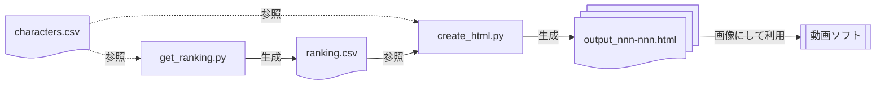

# inmu-family-ranking
淫夢ファミリーランキングの抽出、およびランキング画像生成のためのPythonスクリプトです

# フロー

# 機能

## get_ranking.py
過去の淫夢ファミリーランキングで利用されているポイント計算のための各種情報をWeb、APIからスクレイピングし、ポイント計算、ランク変動などを含めたランキングデータ ranking.csv を作成します。

**VPN環境での実行を推奨します。**

- Pixivの成人向イラストをカウントするためにcookie情報を指定する必要があります
- 人物一覧は characters.csv を参照します
- 過去順位は data/2024.csv を参照します

## make_html.py
ranking.csv を元にランキング動画生成用のための整形済みHTMLファイル output_[nnn-nnn].html を生成します。各HTMLをブラウザ機能で全画面スクショして動画に利用ください。
- 画像は characters.csv を参照します

# データ
## characters.csv
集計対象のキャラクター名のデータです。
大百科の淫夢ファミリーの項目(2026/4時点)からあまりに言いがかりな項目(QVC福島とか)を抜いたものになります
- 1カラム目が大百科の項目名
- 2カラム目が検索用の人物名(未指定の場合は1カラム目を用いる、スペース区切りで複数指定可(OR検索))
- 3カラム目が画像URL

## data/20**.csv
過去動画の順位表です。人物名は大百科の記事名に統一しています。
データは動画からAIに抽出させたデータのため不備があるかもしれません
